# **🏛 Unique - NFT 거래 및 예술관 플랫폼**


 **예술가들의 NFT를 소개하고 누구나 예술가가 되어 자신의 작품을 거래 할 수 있는 NFT 거래 및 예술관 플랫폼**


# WHAT?

### **NFT 거래 & 미술관 플랫폼**

- NFT 작가, 작품을 설명하고 비평하고 이해를 도와주는 서비스
- 누구나 예술가가 되어 자신의 작품을 거래 할 수 있는 서비스

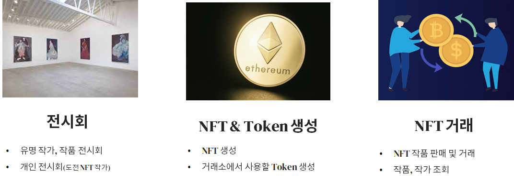

---

# WHY?

### 엄청난 NFT 시장 가치 증가

- Nonfungible.com 보고에 따르면 NFT의 시가총액은 2019년 약 2억1천만 달러였으나, 2021년까지 7억1천만 달러 (출처 :[데일리경제(http://www.kdpress.co.kr)](http://www.kdpress.co.kr/news/articleView.html?idxno=109494))

- 코인 마켓캡 조사 결과, NFT 거래액 30조원 돌파

  

- 출처 : [http://www.kdpress.co.kr/news/articleView.html?idxno=109494](http://www.kdpress.co.kr/news/articleView.html?idxno=109494)

### BUT, 불안정한 NFT 시장

- 심각한 가격변동,

- NFT에 대한 엇갈린 시선, 혁신 VS 버블

  

출처:
 https://www.chosun.com/economy/tech_it/2021/03/12/NCIINJM5BFEKFNM3O2UVDBDBMI/
https://www.chosun.com/economy/mint/2021/12/16/264ER3Z5P5CV7ETWRRR4NZB2GI/
https://www.joongang.co.kr/article/24019914#home
https://m.joseilbo.com/news/view.htm?newsid=449017

### NFT 작품 가치, 가격에 대한 사람들의 의구심

- 한번쯤은 생각해봤을만한 고가의 NFT 가격의 정당성

  

  출처: [http://mbiz.heraldcorp.com/view.php?ud=20210929000650](http://mbiz.heraldcorp.com/view.php?ud=20210929000650)

### NFT 정보와 가치의 관계

- 작품의 가치 평가 기준은 **'정보’**

  > 예술품, 작품을 평가하는 기준은 **작가와 작품의 아이디어, 개념, 태도**

  

- 작품의 정보로 인한 NFT 가치에 대한 평가의 변화

  - 작품의 정보 인식 → 작품에 대한 인식 변화, 가치 정당성 부여

    

  출처: https://opensea.io/

- NFT에 이해도(정보)와 NFT 인식(가치평가)관계

  - **NFT에 대해** 전혀 모르는 사람보다 **잘 이해하는 사람일수록** **NFT에 대한 전망을 더 긍정적으로** 바라보는 것으로 나타남.

    

출처: https://www.tokenpost.kr/article-58522

## 기준 플랫폼 한계

- 유명 사이트의 NFT 작품, 작가에 대한 정보 미흡, 전무한 경우도 존재

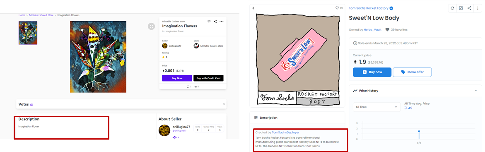

## 결론

- **현 문제점**
  - 예술품 평가 기준을 근거로 했을 때, NFT, 작가와 작품에 대한 이해도(정보)가 부족하여 NFT에 대한 인식 부정적 - > 시장 불안정(NFT작품의 예술성이 아닌, 트렌드에 따른 가치 판단 즉, 투기성 짙음)
  - 기존 NFT 거래 플랫폼은 NFT에 대한 정보 제공 미흡
- **기획 의도(솔루션)**
  - 단지, 판매와 거래만 행해지고 있는 기존 플랫폼에서 벗어나,
    NFT 작가와 작품의 충분한 정보를 소비자들에게 제공함으로써 NFT에 대한 가치 정당성을 부여하고자 함.
- **기대효과**
  - NFT 작가,작품 상세정보 제공으로 NFT에 대한 가치 정당성 부여
  - NFT 작가와 소비자들의 커뮤니티 형성 기여
  - NFT 시장 불안정성 해소에 기여
  - NFT 시장의 건강한 문화 형성 기여

---


# HOW


### 🎞 서비스 화면

---


#### 메인 페이지

---


#### 1. 회원관리

---

##### 로그인 및 회원가입

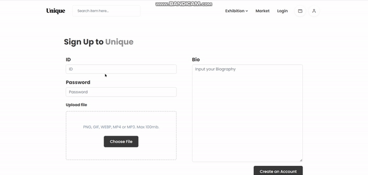

##### 지갑 생성

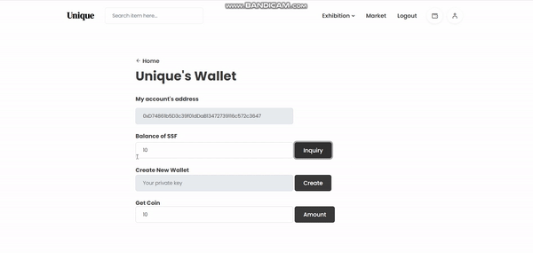

##### 지갑 조회 및 토큰 생성

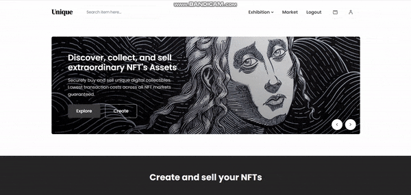

##### 프로필 및 디테일

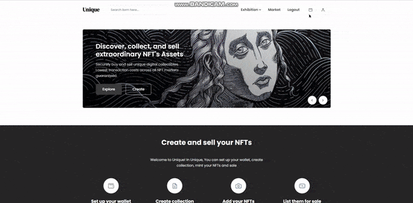


#### 2. NFT 민팅 및 마켓

---

##### NFT 마켓 리스트

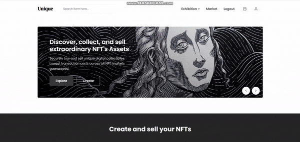

##### NFT 생성


##### NFT 판매

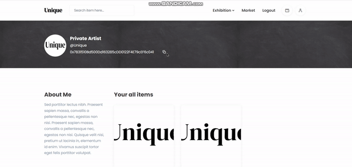

##### NFT 구매

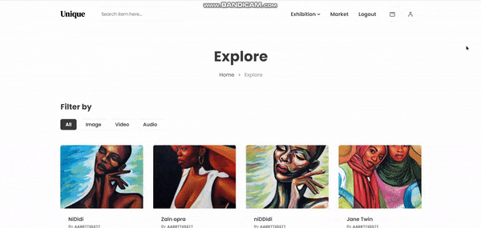

#### 3. 전시회

---

##### Exhibition (전문 Curating)


##### Private Exhibition (개인 작가 전시회) 생성

.gif)

##### Dark Mode

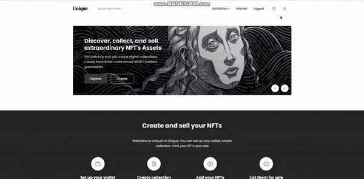


### 🖥 화면 구성 기획

<hr>

#### 와이어 프레임


- [와이어 프레임 보러가기](https://www.figma.com/file/kPGFasAO9c0Lg3TBPQFsGu/Unique(블록체인-P2P-거래)-5팀?node-id=0%3A1)

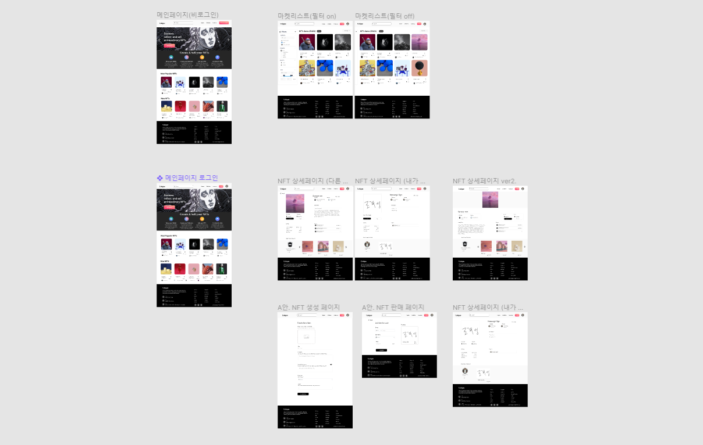


### 📟ER Diagram

<hr>

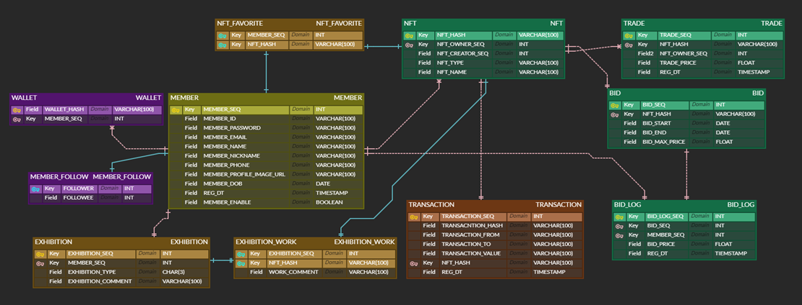


### 📄 **기능 정의서**

<hr>

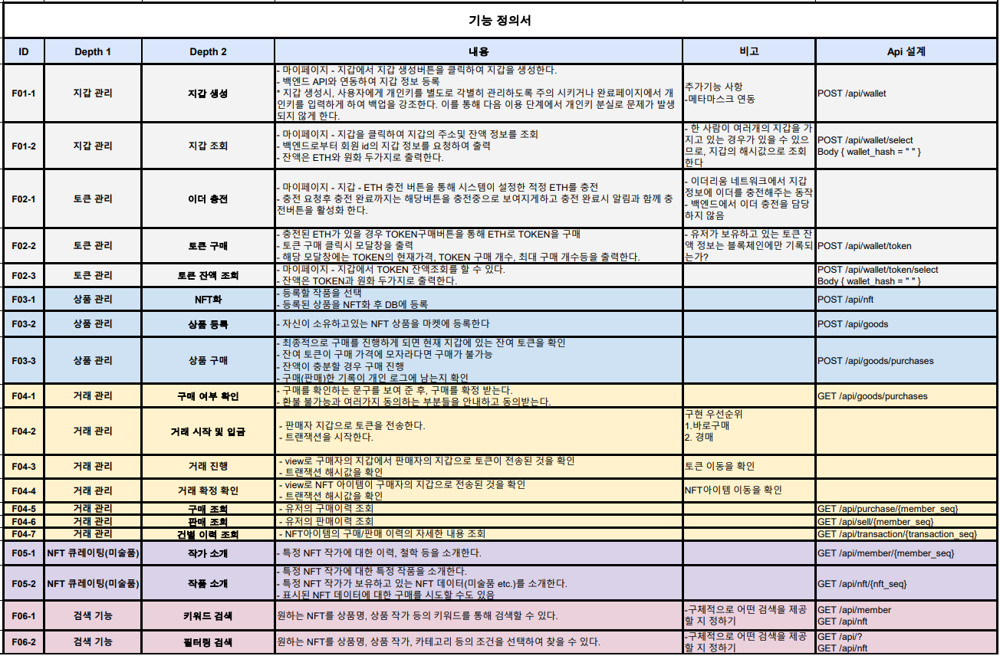


### 🛠 기술 스택

<hr>

**아키텍처 소개**


- 사용 기술 스택
  - 배포 환경 : **Nginx.**
  - 배포 환경 세팅을 위한 **Docker**
  - 스마트컨트랙트 구현을 위한 **Solidity**
  - dapp 개발을 위한 **Truffle**
  - 블록체인 프라이빗 로컬 네트워크를 사용하기 위한 **Ganache**
  - 블록체인 기업 프라이빗 네트워크 ‘**싸피 네트워크’** 사용(**Besu**)
  - 블록체인 네트워크와 프론트엔드의 연결을 위한 **web3.js**
  - 블록체인 네트워크와 백엔드의 연결을 위한 **web3j**
  - NFT 이미지가 포함된 메타더이터를 분산저장하기 위한 **IPFS**
  - api서버와의 통신을 통해 데이터를 사용자 화면에 구성하기 위한 프론트엔드 프레임워크 **VUE.js**
  - RESTful API설계를 위한 **Spring boot**
  - NFT id와 기타 데이터를 저장하기 위한 **MYSQL**


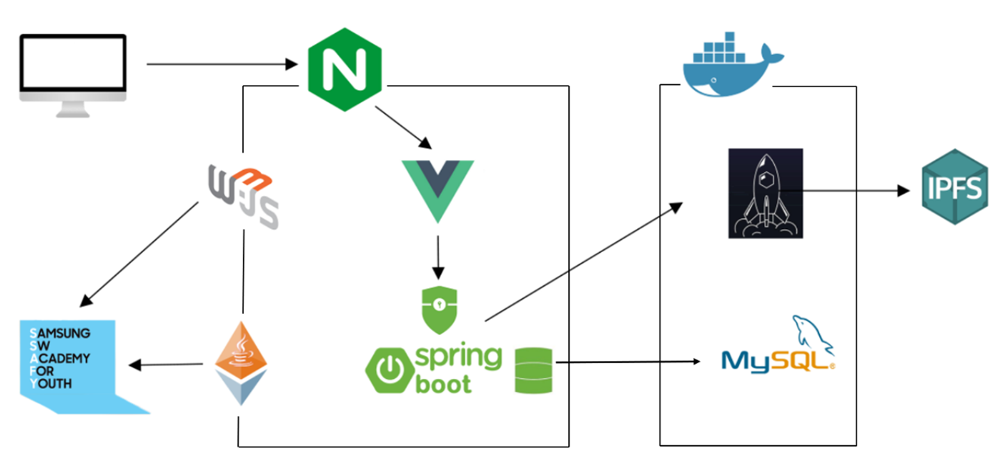

| 기술 스택 | 포트 넘버 |
| --------- | --------- |
| Frontend  | 5500      |
| Backend   | 8081      |
| DB        | 3307      |
| IPFS      | 5001      |
| Ganache   | 8545      |


**싸피 블록체인 노드**

- [http://20.196.209.2:8545](http://20.196.209.2:8545/)
- chain ID: 31221
- Network ID: 202112031219

**ERC-20 토큰(SSF) Contract Address**

- 0x6f2A660762d77974506bd933cEB1D66769fc615c

  

### ✨코드 컨벤션

---

```
- 의미 없는 변수명 X
	⇒ 유지보수 힘들고, 알아보기 힘드니 반드시 지양! ex) text1, test2

- 메서드 이름은 소문자로 시작하고, 동사로 지으면 좋다! ex) getName()

- 변수명, 메서드 이름은 카멜케이스로 지어주세요

- 클래스 이름은 대문자로 시작합니다
```

해당 [Code Convention 가이드](https://udacity.github.io/git-styleguide/), [네이밍 규칙](https://tyboss.tistory.com/entry/Java-자바-네이밍-관습-java-naming-convention)를 참고하여 정했습니다.


### ✨Git 컨벤션

---

```
FEAT:    새로운 기능을 추가할 경우
FIX:     버그를 고친 경우
STYLE:   코드 포맷 변경, 간단한 수정, 코드 변경이 없는 경우
REFATOR: 프로덕션 코드 리팩토링
DOCS:    문서를 수정한 경우(ex> Swagger)
Rename:  파일 혹은 폴더명 수정 및 이동
Remove:  파일 삭제
```

```bash
`#`Jira이슈넘버 + 커밋 타입: Jira내용
ex) S06P22E205-52 feat:[FE] 메인 페이지 - 레이아웃 설정 및 프레임 제작
```


### 💡Git Flow 브랜치 전략

---

- Git Flow model을 사용하고, Git 기본 명령어 사용한다.

- Git Flow 사용 브랜치

  - feature - 기능

    develop - 개발

    master - 배포

    hotfix - 급한 에러 수정

- Git Flow 진행 방식

  1. feature 브랜치가 완성되면 develop 브랜치로 pull request를 통해 merge한다.

     ⇒ pull request가 요청되면, 모든 팀원들이 코드 리뷰를 하여 안전하게 merge한다.

  2. 매 주마다 develop 브랜치를 master 브랜치로 병합하여 배포를 진행한다.

- feature 브랜치 이름 명명 규칙

  - feature/[front or back]/[기능 이름]

    ex) feature/front/login

    ex) feature/NFT


### ✨유니크(UNIQUE) 팀원을 소개합니다!

---

|                            조해성                            |                            조성현                            |                          **김범주**                          |                            임창현                            |
| :----------------------------------------------------------: | :----------------------------------------------------------: | :----------------------------------------------------------: | :----------------------------------------------------------: |
|  |  |  |  |
|                      Leader & Frontend                       |                           Frontend                           |                           Backend                            |                           Backend                            |

### 😃 팀원 역할

---

- **조해성**
- **프로젝트 관리**
    - Jira를 활용한 업무 계획 및 프로세스 진행 관리
    
    - Notion을 활용한 데일리 스크럼, 아이디어 회의, 기획안 등 프로젝트 관련업무 기록
    
  - **와이어 프레임**
  - 메인 페이지, 마켓페이지, NFT 상세페이지, NFT 민팅 및 판매 페이지
  
- **블록체인 네트워크, 스마트컨트랙트**
  
  - ganache 및 truffle을 활용한 로컬 블록체인 네트워크 구축
  
  - truffle과 javascript를 활용하여 SSAFY 프라이빗 네트워크(Besu)에 스마트 컨트랙트 배포
  
  - Solidity를 활용한 openzeppelin의 토큰 표준 erc20, erc721 기반의 스마트 컨트랙트 구현(NFT 생성, SaleFactory 생성(구매 및 판매))
  
  - web3.js를 이용한 SSAFY Network와 연결 및 스마트 컨트랙트 호출(NFT 생성, 거래, 지갑 생성 및 조회, 토큰 발행 및 조회 등)


  - **프론트엔드**
    - 메인페이지, 마켓 페이지, 지갑 생성, 토큰 발급 및 조회 페이지, NFT 생성 및 판매 페이지, NFT Exhibition 구현

  

- **조성현**

  **와이어 프레임**

  - 로그인/회원가입 페이지, 전시회 페이지, 개인 전시회 페이지, 프로필 및 마이페이지

  **블록체인 네트워크, 스마트 컨트랙트**

  - ganache 및 truffle을 활용한 로컬 블록체인 네트워크 구축
  - truffle과 javascript를 활용하여 SSAFY 프라이빗 네트워크(Besu)에 스마트 컨트랙트 배포
  - Solidity를 활용한 openzeppelin의 토큰 표준 erc20, erc721 기반의 스마트 컨트랙트 구현(NFT 생성)
  - web3.js를 이용한 SSAFY Network와 연결 및 스마트 컨트랙트 호출(NFT 생성, 지갑 생성 및 조회, 토큰 발행 및 조회 등)

  **프론트엔드**

  - NFT Exhibition, Private Exhibition, Detail 페이지, Profile/Mypage 페이지

  - Dark Mode

    

- **김범주**

  - Entity와 DB 테이블 구축, ERD 다이어그램 구현

  - Spring Boot & JPA를 활용하여 NFT, 마켓, 유저 관련 기능 구현

  - Web3j를 이용하여 SSAFY Network에 연결 및 SSF 조회, 거래 기능 구현

  - EC2 Ubuntu 환경에서 Docker와 Nginx를 활용하여 BE,FE, IPFS 통합 배포 진행

    

- **임창현**

  - Entity와 DB 테이블 Jpa mapping
  - Spring Boot와 Jpa를 이용한 멤버 관리, 마켓 관리, 전시회 관리, 프로필 이미지 관리 구현
  - go-ipfs를 이용한 IPFS에 NFT 파일 업로드 구현
  - Spring Security를 이용한 JWT 발급 및 JWT를 이용한 권한 관리 구현
  - web3j를 이용한 SSAFY Network와 연결 및 SSF(싸피토큰) 조회, 거래기능 구현
  - ERD 다이어그램 구현
