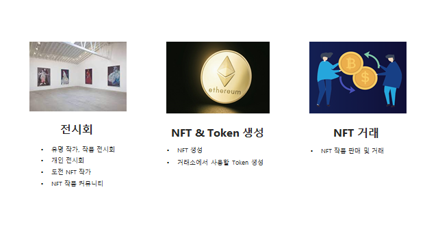
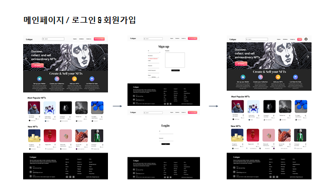
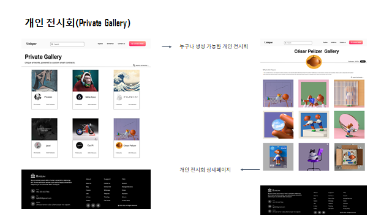
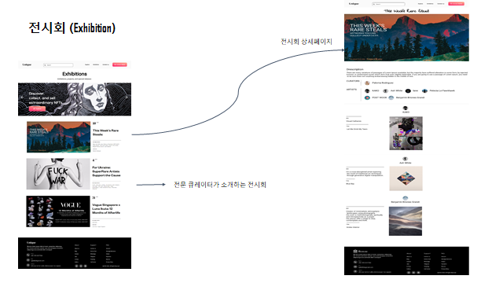
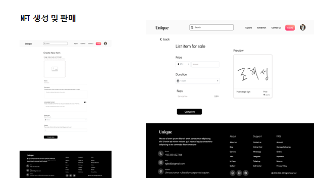
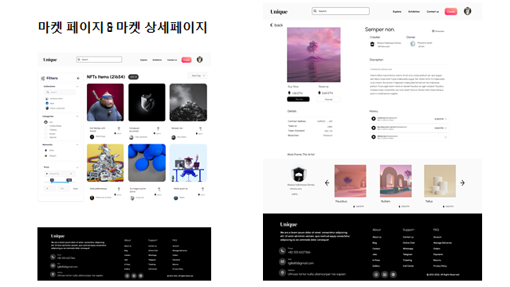
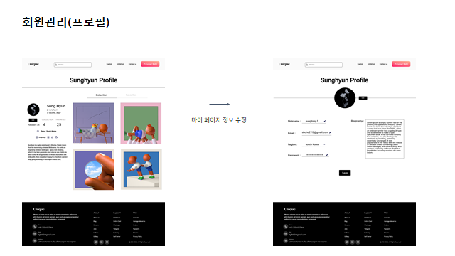
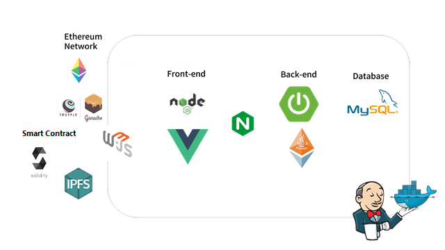

# **🏛 Unique - NFT 거래 및 예술관 플랫폼**


 **예술가들의 NFT를 소개하고 누구나 예술가가 되어 자신의 작품을 거래 할 수 있는 NFT 거래 및 예술관 플랫폼**

### 🖋 기획

#### ✔주요 기능

<hr>



### 🎞 서비스 화면

---


#### 메인 페이지

---


#### 1. 회원관리

---

##### 로그인 및 회원가입


##### 지갑 생성


##### 지갑 조회 및 토큰 생성


##### 프로필 및 디테일


#### 2. NFT 민팅 및 마켓

---

##### NFT 마켓 리스트


##### NFT 생성


##### NFT 판매


##### NFT 구매


#### 3. 전시회

---

##### Exhibition (전문 Curating)


##### Private Exhibition (개인 작가 전시회) 생성

.gif)

##### Dark Mode


### 🖥 화면 구성 기획

<hr>













### 📟ER Diagram

<hr>


### 📄 **기능 정의서**

<hr>


### 🛠 기술 스택

<hr>




### ✨코드 컨벤션

---

```
- 의미 없는 변수명 X
	⇒ 유지보수 힘들고, 알아보기 힘드니 반드시 지양! ex) text1, test2

- 메서드 이름은 소문자로 시작하고, 동사로 지으면 좋다! ex) getName()

- 변수명, 메서드 이름은 카멜케이스로 지어주세요

- 클래스 이름은 대문자로 시작합니다
```

해당 [Code Convention 가이드](https://udacity.github.io/git-styleguide/), [네이밍 규칙](https://tyboss.tistory.com/entry/Java-자바-네이밍-관습-java-naming-convention)를 참고하여 정했습니다.

### ✨Git 컨벤션

---

```
FEAT:    새로운 기능을 추가할 경우
FIX:     버그를 고친 경우
STYLE:   코드 포맷 변경, 간단한 수정, 코드 변경이 없는 경우
REFATOR: 프로덕션 코드 리팩토링
DOCS:    문서를 수정한 경우(ex> Swagger)
Rename:  파일 혹은 폴더명 수정 및 이동
Remove:  파일 삭제
```

```bash
`#`Jira이슈넘버 + 커밋 타입: Jira내용
ex) S06P22E205-52 feat:[FE] 메인 페이지 - 레이아웃 설정 및 프레임 제작
```

### 💡Git Flow 브랜치 전략

---

- Git Flow model을 사용하고, Git 기본 명령어 사용한다.

- Git Flow 사용 브랜치

  - feature - 기능

    develop - 개발

    master - 배포

    hotfix - 급한 에러 수정

- Git Flow 진행 방식

  1. feature 브랜치가 완성되면 develop 브랜치로 pull request를 통해 merge한다.

     ⇒ pull request가 요청되면, 모든 팀원들이 코드 리뷰를 하여 안전하게 merge한다.

  2. 매 주마다 develop 브랜치를 master 브랜치로 병합하여 배포를 진행한다.

- feature 브랜치 이름 명명 규칙

  - feature/[front or back]/[기능 이름]

    ex) feature/front/login

    ex) feature/webrtc

### ✨유니크(UNIQUE) 팀원을 소개합니다!

---

|                    조해성                     |                         조성현                         |                     **김범주**                     |                          임창현                          |
| :-------------------------------------------: | :----------------------------------------------------: | :------------------------------------------------: | :------------------------------------------------------: |
|  |  |  |  |
|               Leader & Frontend               |                        Frontend                        |                      Backend                       |                         Backend                          |

### 😃 팀원 역할

---

- **조해성**

  -

- **조성현**

  -

- **김범주**

  -

- **임창현**

  -
